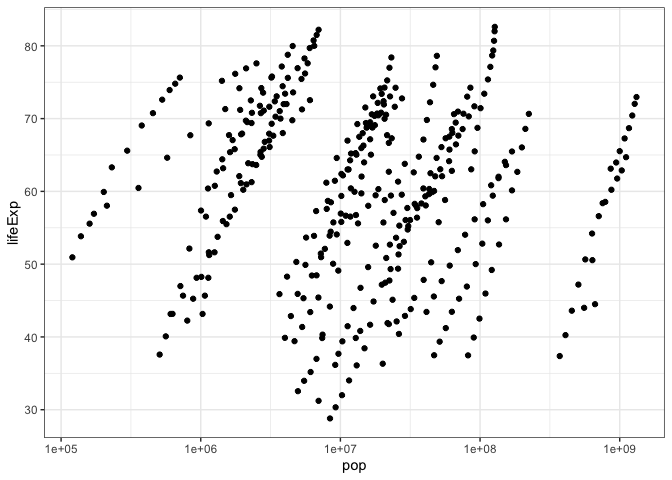
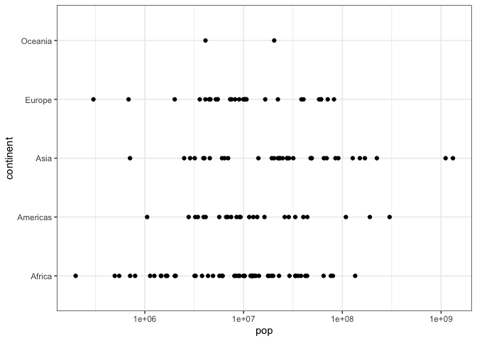
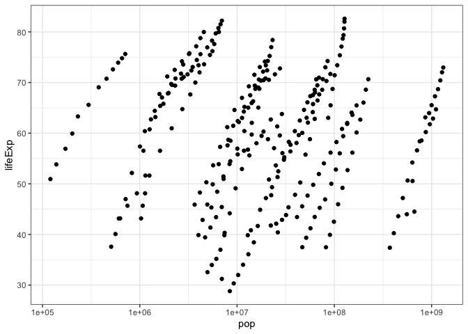
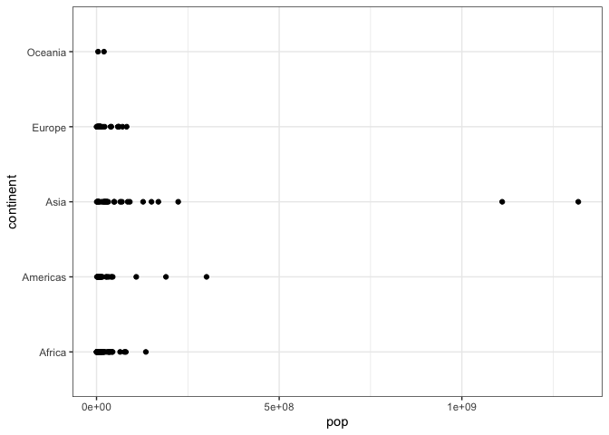

fancyplots
================

<!-- README.md is generated from README.Rmd. Please edit that file -->

# `fancyplots`

<!-- badges: start -->


<!-- badges: end -->

The goal of fancyplots is to make logarithmically scaled x axis scatter
plots **and nothing more**.

## Installation

You can install the released version of fancyplots from [my github
repo](https://github.com/kaitsull/fancyplots) with:

``` r
devtools::install_github("kaitsull/fancyplots")
```

## How it was made with `devtools`\!

1.  First, after loading the `devtools` package, I instantiated the
    package with the command: `create_tidy_package("fancyplots")` and
    then created a git repo on my local computer via `use_git`.
2.  Then I created my function script via `use_r("scatter_plot_logx")`,
    and added documentation using `roxygen2` special commenting with the
    `#'` symbol combination.
3.  Since my function requires `ggplot2`, I added this dependency to my
    description file using `use_package("ggplot2")`
4.  Then, I used the `use_test("scatterplot")` command (via first using
    the `use_testthat()` function) to write multiple tests which I
    checked via the `check()` function\!
5.  Once my tests ran without failure, I instantiated this README.md
    file (via `use_readme_rmd()` and `build_readme()`) - as well as a
    vignette (via `use_vignettes()` and `build_vingnettes()`)
6.  Finally, I linked up this package to my github repo using
    `use_github()`

**BONUS:** 1. badges (at top of readme) 2.
[Website](https://kaitsull.github.io/fancyplots/) 3. Changelog for
release 4. Code of conduct (in repo)

## Examples with `scatter_plot_logx`

#### making scatterplots with a logarithmically scaled x axis\!\!\!

(the only function in this package :sweat\_smile:)

##### Example 1: Numerical Y Axis

Here is how `fancyplots` *scatter\_plot\_x* function works with the
gapminder dataset. In this example, our y axis will be *lifeExp*, which
contains the average life expectancy of each country over the years.

This graph shows *population vs life expectancy* in the countries of
Asia from 1952-2007.

``` r
library(fancyplots)

example1 <- filter(gapminder, continent == "Asia")
scatter_plot_logx(example1, "pop", "lifeExp")
#> Removing NA values from the data set... 
#> Plotting columns "pop" vs  "lifeExp" 
#> Printing plot...
```



##### Example 2: Factors as the Y Axis

Here is how `fancyplots` *scatter\_plot\_x* function works with the
gapminder dataset. In this example, our y axis will be *continent*.

This graph shows us the spread of the population in the countries of
each continent in 2007.

``` r
library(fancyplots)
example2 <- filter(gapminder, year == 2007)
scatter_plot_logx(example2, "pop", "continent")
#> Removing NA values from the data set... 
#> Plotting columns "pop" vs  "continent" 
#> Printing plot...
```



## Default Features

##### `na.omit`

The `scale_log_x` by default removes any NA’s within your dataset via
**na.omit** = TRUE\!

Below is plotting of example 1 with multiple NAs inserted.

``` r
#adding NAs to rows 150-250
example1[150:250, ] <- NA

scatter_plot_logx(example1, "pop", "lifeExp", na.omit = TRUE)
#> Removing NA values from the data set... 
#> Plotting columns "pop" vs  "lifeExp" 
#> Printing plot...
#> Warning: Removed 101 rows containing missing values (geom_point).
```



##### `logx`

The `scale_log_x` by default scales the x axis of your plot via **logx**
= TRUE\!

Below is example 2, plotting with **logx** = FALSE

``` r
scatter_plot_logx(example2, "pop", "continent", logx = FALSE)
#> Removing NA values from the data set... 
#> Plotting columns "pop" vs  "continent" 
#> Printing plot...
```



##### `verbose`

Finally, the `scale_log_x` by default has a **verbose** option set to
TRUE\! This prints those update messages one sees prior to the plot. You
can similarly turn off these messages by making **verbose** equal to
FALSE.
